# ACSL (American Computer Science League) Comprehensive Tutoring Curriculum

Welcome to the **ACSL Tutoring Master Program**. This repository contains a complete, turnkey 16-session curriculum (4 Units × 4 Classes per Unit) designed for coaches, tutors, and competitive programming students across **Elementary**, **Junior**, and **Intermediate** divisions.

---

## 🏛️ Curriculum Architecture

The curriculum is structured across the **4 Official ACSL Contests**:

| Unit | Core Topics Covered | Divisions & Teaching Assets | Class Count |
| :--- | :--- | :--- | :--- |
| **[Unit 1: Number Systems & Recursion](./Unit_1_Number_Systems/)** | Number Systems (Bases 2, 8, 16, $b$), Binary Arithmetic, Recursion, Pseudocode ("What Does This Program Do?") | Elementary, Junior, Intermediate<br>• [Homework Sets](./Unit_1_Number_Systems/elementary/homework.md) \| [Markdown Slides](./Unit_1_Number_Systems/elementary/slides.md) \| **[PowerPoint (.pptx)](./Unit_1_Number_Systems/elementary/slides.pptx)** | 4 Classes × 90 Mins |
| **[Unit 2: Bit-String Flicking & Prefix/Postfix](./Unit_2_Bit_String_and_Notation/)** | Bit-String Flicking (NOT, AND, OR, XOR, Shifts, Circular Shifts), Expression Notation (Infix, Prefix, Postfix) | Elementary, Junior, Intermediate<br>• [Homework Sets](./Unit_2_Bit_String_and_Notation/elementary/homework.md) \| [Markdown Slides](./Unit_2_Bit_String_and_Notation/elementary/slides.md) \| **[PowerPoint (.pptx)](./Unit_2_Bit_String_and_Notation/elementary/slides.pptx)** | 4 Classes × 90 Mins |
| **[Unit 3: Boolean Algebra & Data Structures](./Unit_3_Boolean_Algebra_and_Data_Structures/)** | Boolean Laws, Simplification, Truth Tables, K-Maps, Stacks, Queues, Binary Search Trees | Elementary, Junior, Intermediate<br>• [Homework Sets](./Unit_3_Boolean_Algebra_and_Data_Structures/elementary/homework.md) \| [Markdown Slides](./Unit_3_Boolean_Algebra_and_Data_Structures/elementary/slides.md) \| **[PowerPoint (.pptx)](./Unit_3_Boolean_Algebra_and_Data_Structures/elementary/slides.pptx)** | 4 Classes × 90 Mins |
| **[Unit 4: Graph Theory & Digital Electronics](./Unit_4_Graph_Theory_and_Digital_Electronics/)** | Graph Theory, Matrix Powers, Eulerian/Hamiltonian Paths, Logic Gates, Half/Full Adders, ACSL Assembly | Elementary, Junior, Intermediate<br>• [Homework Sets](./Unit_4_Graph_Theory_and_Digital_Electronics/elementary/homework.md) \| [Markdown Slides](./Unit_4_Graph_Theory_and_Digital_Electronics/elementary/slides.md) \| **[PowerPoint (.pptx)](./Unit_4_Graph_Theory_and_Digital_Electronics/elementary/slides.pptx)** | 4 Classes × 90 Mins |

---

## 📁 Repository Directory Structure

```text
ACLC/
├── README.md                                  # Global Curriculum Overview & Pedagogical Guide
├── generate_pptx.py                           # Automated PowerPoint Generator Engine
├── Unit_1_Number_Systems/
│   ├── README.md                              # Unit 1 Overview, Syllabus & Objectives
│   ├── elementary/ (README.md, homework.md, slides.md, slides.pptx)
│   ├── junior/     (README.md, homework.md, slides.md, slides.pptx)
│   └── intermediate/ (README.md, homework.md, slides.md, slides.pptx)
├── Unit_2_Bit_String_and_Notation/
│   ├── README.md                              # Unit 2 Overview, Syllabus & Objectives
│   ├── elementary/ (README.md, homework.md, slides.md, slides.pptx)
│   ├── junior/     (README.md, homework.md, slides.md, slides.pptx)
│   └── intermediate/ (README.md, homework.md, slides.md, slides.pptx)
├── Unit_3_Boolean_Algebra_and_Data_Structures/
│   ├── README.md                              # Unit 3 Overview, Syllabus & Objectives
│   ├── elementary/ (README.md, homework.md, slides.md, slides.pptx)
│   ├── junior/     (README.md, homework.md, slides.md, slides.pptx)
│   └── intermediate/ (README.md, homework.md, slides.md, slides.pptx)
└── Unit_4_Graph_Theory_and_Digital_Electronics/
    ├── README.md                              # Unit 4 Overview, Syllabus & Objectives
    ├── elementary/ (README.md, homework.md, slides.md, slides.pptx)
    ├── junior/     (README.md, homework.md, slides.md, slides.pptx)
    └── intermediate/ (README.md, homework.md, slides.md, slides.pptx)
```

---

## ⏱️ Standard 90-Minute Class Lesson Blueprint

Every class in this curriculum strictly adheres to a battle-tested **90-Minute Pedagogical Framework**:

```mermaid
gantt
    title Standard 90-Minute ACSL Tutoring Session Flow
    dateFormat  m
    axisFormat %M min
    section Structure
    Warm-up & Homework Diagnostic :0, 15m
    Core Theoretical Deep-Dive    :15, 30m
    Guided Pattern Solving        :45, 25m
    Timed Contest Drill           :70, 15m
    Pitfall Review & Assignments  :85, 5m
```



1. **0:00 – 0:15 (15 Mins) — Warm-up & Diagnostic Review**:
   - Rapid-fire retrieval quiz (3 questions from prior session).
   - Review homework roadblocks and clarify misconceptions.
2. **0:15 – 0:45 (30 Mins) — Core Theoretical Deep-Dive**:
   - Conceptual introduction using visual diagrams and mathematical foundations.
   - Live blackboard derivation (e.g. base arithmetic, tree rotations, Karnaugh mapping).
3. **0:45 – 0:70 (25 Mins) — Guided Problem-Solving & Pattern Recognition**:
   - Step-by-step breakdown of 3–5 representative ACSL contest questions.
   - Teaching "Speed Shortcuts" and eliminating brute-force calculation errors.
4. **0:70 – 0:85 (15 Mins) — Timed Contest Drill & Simulation**:
   - Students work independently on 3–5 real past contest questions under timed test conditions (3 minutes per question).
   - Simulates the HackerRank / official online testing environment.
5. **0:85 – 0:90 (5 Mins) — Post-Drill Debrief, Pitfall Traps & Homework**:
   - Immediate review of common mistakes.
   - Distribution of homework problem sets and supplemental reading.

---

## 🎯 Target Division Breakdown

- **Elementary Division (Grades 3–6)**:
  - Focuses on foundational logic, intuitive visual understanding, mental arithmetic, and simple pseudocode execution.
- **Junior Division (Grades 7–9)**:
  - Focuses on formal algorithmic definitions, recursion trees, standard bitwise operators, tree data structures, and boolean simplification.
- **Intermediate Division (Grades 10–12)**:
  - Advanced contest level: K-Maps, fractional base arithmetic, graph matrix exponentiation, complex recursion, and competitive programming problem patterns.

---

## 🏆 ACSL Contest Format Reference
- **Short Answer Test**: 5 questions, 30 minutes total (6 minutes/question average, but aiming for 2–3 minutes/question for high scorers).
- **Programming Problem (Junior & Intermediate)**: 1 problem, 72-hour window on HackerRank or timed in-school session. Each unit includes code walk-throughs and test cases.
